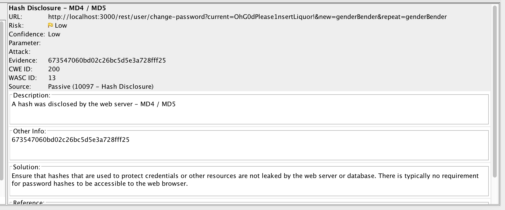

# juice-shop-security-tests
This repo is used to demo various security tests for NodeJS on the famous vulnerable application - [Juice Shop](https://github.com/bkimminich/juice-shop).
To get a better understanding of what kind of security tests exist, please reffer to my [blog post](https://www.h.info/2018/10/04/write-good-code-with-security-tests/).
To use this repository, either clone juice shop locally, or use other JS source code.

## Static Anlysis
For static analysis, we can use [NodeJSScan](https://github.com/ajinabraham/NodeJsScan). 
As it is has official docker image, running it is as simple as running the following command:
```
docker run -it -p 9090:9090 opensecurity/nodejsscan:latest
```
And then open `http://localhost:9090` in you favourite browser.
You should see this nice, welcoming UI:

Click to choose a zip file and wait for the scan to complete.
You should see a detailed report like this (hopefully, if this is your code, with less findings):

Let's inspect the scan results for Juice Shop (you can find the report [here](nodejsscan/Scan Result - NodeScanV2.htm)). 
Let's take a look on the SQL injection vulnerability:

NodeJsScan reported an issue on the login page.
Testing is simple - open the login page and try to login with the following credentials:
```
email: ' or 1=1--
password: a <or anything else actually, it doesn't matter>
```
Violla, logged-in succesfully - there is a reall SQL injection here, spoted by NodeJsScan.

## Dynamic Analysis
For dynamic analysis, I like to use [OWASP Zap](https://github.com/zaproxy/zaproxy).
The easiet way to achieve that is by levereging the existing e2e test of juice shop. 
To run the tests and proxy them using Zap all that is required is running the following command:
```
http_proxy=http://localhost:8080 yarn run e2e
```
Assuming that Zap is running and that `http://localhost:8080` is Zap's proxy address. 
After the test completed, we can take a look at Zap's alerts to look for interesting findings:

Looking on the alerts, we can notice one interesting alerts - indication the the use MD5:

This is an interesting finding - look like the app use MD5 to hash the password which means that either the passwords are stored in the database in plain-text or hashed with MD5. In both case, all that we need is SQLi and we can dump all the password. Oh wait, we already find SQLi!

## Packages Scan
The last thing we need to scan is all the packages we're using. 
Here we can use 2 tools.
The first is the built-in [NPM Audit](https://docs.npmjs.com/cli/audit) command, that is shipped as part of NPM. 
It can be used to scan all your dependencies for knonw security issues and even help you fix them. 
The second tool, which I'll also deep-dive into today, is [Snyk](https://snyk.io/). 
The only downside of Snyk - it's a commercial tool.

Let's use Snyk to scan all the dependencies of Juice Shop. 
Run the following command in the root folder:
```
snyk test
```
You can see the full report [here](snyk/report.json).
Let's inpect the finding. 
Not surprising, we have many high vulnerabilities alerts, but I want to focus on one of the medium alerts that is exploitable. 
Juice Shop uses a vulnerable version of `sanitize-html`, a library that used to sanitize user input - as a mitigation of XSS.
Not surprising, this version did not do sanitize well, and therefore - it's vulnerable to XSS atacks. 
After looking on the [GitHub issue](https://github.com/punkave/sanitize-html/issues/29), we can learn how to build a payload that will exploit this attack.
Left the following comment on the feedback page:
```
I'm harmless <<script>Foo</script>iframe src="javascript:alert(`xss`)">
```
And when accessing the About Us page, scroll through the images. 
A nice alert should show - indication that our exploit worked!